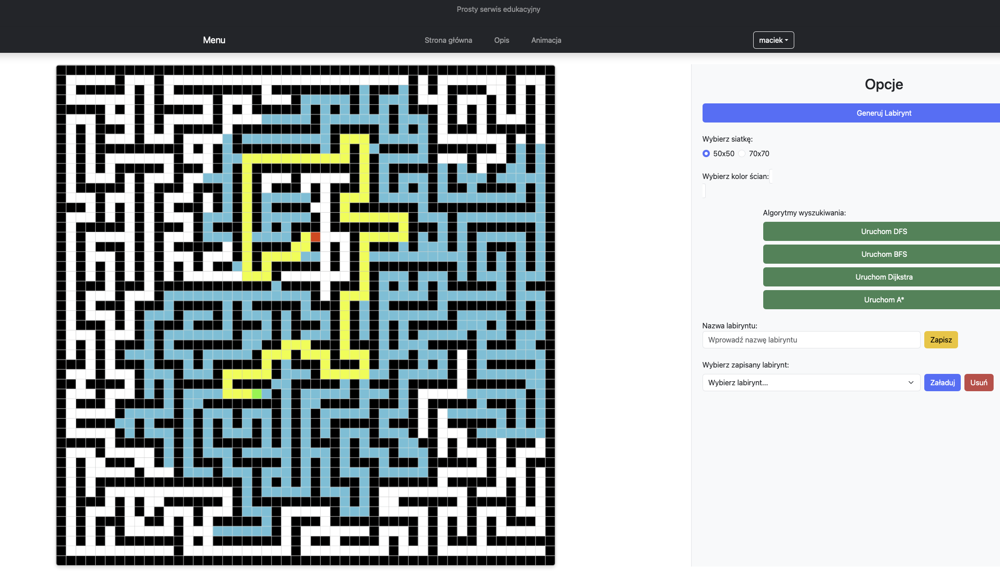

# Graph Algorithm Visualization App

A Node.js and Express-based web application for visualizing graph algorithms, such as **Dijkstra**, **DFS**, **BFS**, and **A\***, on a dynamically generated maze. The app allows users to generate mazes, select start and end points, and visualize the path using various graph algorithms. It also includes JWT authentication for user login and registration, enabling users to save and later replay their generated mazes with custom colors.



## Table of Contents
- [Description](#description)
- [Installation](#installation)
- [Usage](#usage)
- [Technologies](#technologies)


## Description

This application provides an interactive environment for visualizing popular graph traversal algorithms on a randomly generated maze. Users can select a start and end point within the maze and then run one of the supported algorithms to find the shortest path. Additionally, the application allows user authentication (via JWT) so that users can log in, register, and save their generated mazes for future use.

### Key Features:
- **Maze Generation**: Dynamically generate a maze of varying sizes.
- **Graph Algorithms**: Visualize the shortest path using algorithms like:
    - **Dijkstra**
    - **DFS (Depth-First Search)**
    - **BFS (Breadth-First Search)**
    - **A\*** (A-star)
- **User Authentication**: Register and log in to save and load generated mazes.
- **Save and Replay Mazes**: Users can save their mazes and reload them later with customizable colors.
- **Interactive Visualization**: Set start and end points, run algorithms, and visualize the results in real-time.

## Installation

To get started with the project locally, follow these steps:

1. **Clone the repository**:
   ```bash
    git clone https://github.com/maciekgangus/Pathfinding-Visualizer.git
   ```
2. **Navigate to the project directory**:
   ```bash
    cd Pathfinding-Visualizer
    ```
3. **Install dependencies**:
   ```bash
    npm install
    ```
4.  **Run the project locally**:
   ```bash
    node app.js
   ```

## Usage 

**Acces the app by typing the following in your browser**:
```bash
localhost:3000
```

## User Authentication

- **Register**: Create a new user account by providing a **username** and **password**.
- **Login**: After registering, log in to obtain a **JWT token**. This token will allow you to access your account and save mazes.

## Visualizing Algorithms

1. **Adjust params**: Choose the grid type (50x50/70x70) and the colour of your maze.
2. **Generate Maze**: Create a new maze.
2. **Set Start and End Points**: Click on the maze to define the start (LMB) and end points (RMB).
3. **Select Algorithm**: Choose one of the following algorithms to visualize a path:
    - **Dijkstra**
    - **DFS**
    - **BFS**
    - **A\***
4. **Visualize**: Watch as the algorithm runs and finds the path in a maze.

## Saving and Replaying Mazes

- Once you’ve generated a maze, you can **save it** to your account.
- Later, you can log in and **replay the maze** with the same start and end points.

## Technologies

- **Node.js**: Backend framework for handling HTTP requests and logic.
- **Express.js**: Framework for building the RESTful API.
- **JWT (JSON Web Tokens)**: User authentication and authorization.
- **Sqlite**: Database to store user data and saved mazes.
- **Canvas**: Used for rendering the maze and pathfinding algorithms in the browser.

